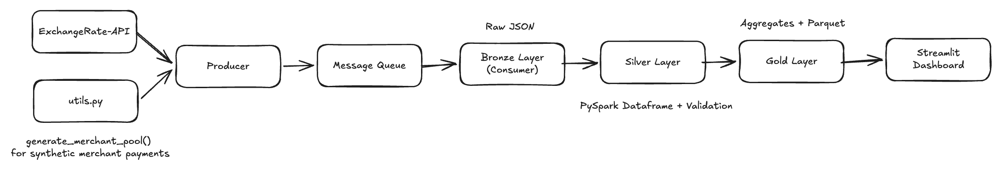
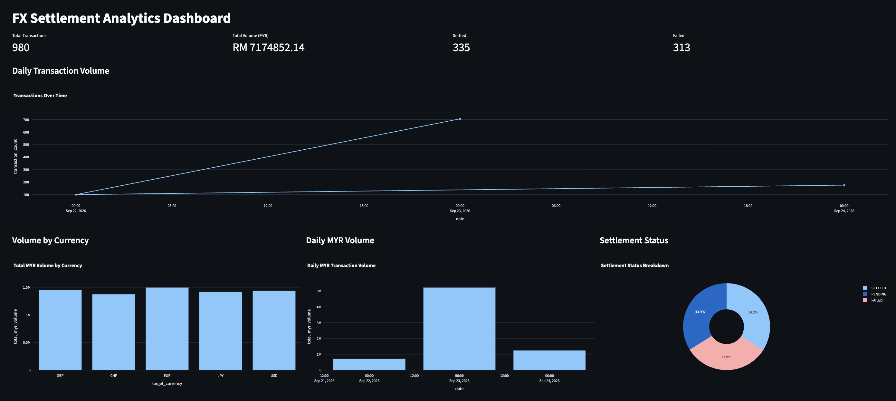

# FX Settlement ETL Pipeline

An end-to-end data pipeline that simulates cross-border merchant settlements from Malaysian Ringgit (MYR) into foreign currencies using **live exchange rates**. Transactions are streamed through a message queue, refined through a **Bronze → Silver → Gold medallion architecture** with PySpark, and shown on a Streamlit analytics dashboard.

## Overview

Payment platforms that settle merchant payouts across currencies need a reliable way to capture each transaction, apply the correct FX rate, and report on volumes and settlement outcomes. This project models that flow on a small scale:

- A **producer** fetches live MYR exchange rates from [ExchangeRate-API](https://www.exchangerate-api.com/) and generates synthetic merchant settlement transactions (MYR → EUR, GBP, USD, JPY, CHF).
- Each transaction is published to **RabbitMQ**, which separates ingestion from processing.
- A **consumer** writes the raw messages into the **Bronze** layer as newline-delimited JSON.
- **PySpark** jobs clean and validate the data into **Silver** (Parquet), then aggregate it into **Gold** summary tables.
- A **Streamlit** dashboard reads the Gold tables to show KPIs and trends.
- A single orchestrator, `main.py`, runs every stage in order.

## What I Aimed to Learn

- **Streaming ingestion with a message broker**: how producers and consumers are decoupled through a durable queue, and how manual acknowledgements (`ack`/`nack`) keep messages from being lost.
- **Medallion architecture**: why data is kept raw in Bronze, cleaned in Silver and aggregated in Gold, and what each layer is responsible for.
- **Batch processing with PySpark**: reading semi-structured JSON, casting types, deduplicating, filtering bad records and writing columnar Parquet.
- **Working with a real external API**, including authentication, error handling and rate limits.
- **Pipeline orchestration**: coordinating long-running streaming processes with batch jobs, and handling failures and shutdown cleanly.
- **Turning pipeline output into insight** with a lightweight analytics dashboard.

## Tech Stack

| Area          | Tools                                                         |
| ------------- | ------------------------------------------------------------- |
| Language      | Python 3.11                                                   |
| Data source   | ExchangeRate-API (live FX rates), Faker (synthetic merchants) |
| Messaging     | RabbitMQ (via `pika`), run with Docker Compose                |
| Processing    | PySpark                                                       |
| Storage       | JSON (Bronze), Parquet (Silver and Gold)                      |
| Visualisation | Streamlit, Plotly, pandas                                     |
| Config        | python-dotenv                                                 |

## How It Works



1. **Merchant pool (`etl/utils.py`)**: `generate_merchant_pool()` uses Faker to create 25 synthetic merchants, each with an ID, name, tier (Enterprise / MNC / Startup) and a custom fee rate. The pool is saved to `data/merchant_dim.json` as a merchant dimension.
2. **Producer (`etl/producer.py`)**: fetches the latest MYR conversion rates from ExchangeRate-API, picks a random merchant, target currency and gross amount, applies the live rate and publishes a transaction to the durable `settlement_fx_queue` in RabbitMQ. Each transaction is randomly marked `SETTLED`, `PENDING` or `FAILED`.
3. **Message queue (RabbitMQ)**: buffers transactions between the producer and consumer. Messages are persistent, so they survive a broker restart.
4. **Bronze layer (`medallion/01_bronze.py`)**: the consumer checks that each message is valid JSON, appends it to a daily file (`data/bronze/settlement_fx_YYYY-MM-DD.json`) and only then acknowledges it. Messages that fail are requeued.
5. **Silver layer (`medallion/02_silver.py`)**: PySpark reads all Bronze files, removes duplicates, casts the numeric columns to `double`, drops records with non-positive amounts or rates, and writes Parquet to `data/silver/`.
6. **Gold layer (`medallion/03_gold.py`)**: builds three aggregate tables from Silver:
   - `currency_summary`: transaction count and total MYR volume per target currency
   - `status_summary`: transaction count per settlement status
   - `daily_summary`: daily transaction count, total and average MYR volume, and settled and failed counts
7. **Dashboard (`dashboard/analytics.py`)**: a Streamlit app that reads the Gold Parquet tables.

### Orchestration (`main.py`)

`main.py` runs the whole pipeline with one command:

1. **Streaming stage**: starts the producer and the Bronze consumer as background processes. It checks Bronze every second and stops when the time window ends (`--duration`) or a target number of records has landed (`--messages`). If either process crashes, the run stops with a clear error.
2. **Shutdown**: both processes are terminated gracefully, and killed if they don't exit within the 5-second grace period.
3. **Batch stage**: runs Silver and then Gold in order. The run stops at the first stage that fails, so Gold never builds on incomplete Silver data.

## How to Run

### Prerequisites

- Python 3.11
- Java 17 (required by PySpark)
- Docker (for RabbitMQ)
- A free API key from [ExchangeRate-API](https://www.exchangerate-api.com/)

### 1. Clone and install dependencies

```bash
git clone https://github.com/makemeswey/fx-etl-pipeline.git
cd fx-etl-pipeline

python -m venv venv
source venv/bin/activate
pip install -r requirements.txt
pip install plotly pyarrow   # used by the dashboard
```

### 2. Configure environment variables

Create a `.env` file in the project root:

```env
EXCHANGE_RATE_API_KEY=your_api_key
RABBIT_MQ_USER=admin
RABBIT_MQ_PASSWORD=admin
RABBIT_MQ_HOST=localhost
RABBIT_MQ_PORT=5672
```

### 3. Start RabbitMQ

```bash
docker compose up -d
```

The RabbitMQ management UI is at http://localhost:15672. Log in with the credentials from your `.env`.

### 4. Run the pipeline

```bash
# Stream for 60 seconds (default), then run Silver and Gold
python main.py

# Stream for up to 2 minutes, stopping early once 500 records reach Bronze
python main.py --duration 120 --messages 500

# Skip streaming and rebuild Silver and Gold from the existing Bronze data
python main.py --skip-stream
```

To check the Gold tables in the terminal, run `python medallion/test.py`.

### 5. Launch the dashboard

```bash
streamlit run dashboard/analytics.py
```

Open http://localhost:8501 to see the dashboard:



The dashboard shows:

- **KPIs**: total transactions, total volume (MYR), and settled and failed counts
- **Daily transaction volume**: transactions over time
- **Volume by currency**: total MYR volume per target currency
- **Daily MYR volume**: total value processed per day
- **Settlement status**: breakdown of `SETTLED`, `PENDING` and `FAILED`

## Challenges Faced

### Free API limits

The ExchangeRate-API free tier allows only a limited number of requests per month, and its rates update once a month. My first producer called the API for every transaction it generated, so a short streaming run could use up a large part of the monthly quota in minutes, even though every call returned the same rates. This affected how I ran and tested the pipeline:

- I kept streaming runs short and bounded, which is one reason `main.py` supports `--duration` and `--messages` limits.
- I added `--skip-stream` so Silver, Gold and the dashboard can be rebuilt from existing Bronze data without making any more API calls.
- API and HTTP errors are logged, and the producer backs off for a few seconds after failures instead of retrying straight away.

### Orchestrating the ETL pipeline across medallion layers

Coordinating the stages was harder than writing any one of them, because they run in different ways:

- **Streaming and batch stages behave differently.** The producer and consumer run in infinite loops and never exit on their own, while Silver and Gold are batch jobs that run once and finish. The orchestrator has to run the streaming stage for a bounded time and then shut it down cleanly before the batch jobs start. I solved this with background subprocesses, a deadline or record-count stop condition, and graceful termination with a kill fallback.
- **Deciding when Bronze is "done".** Since there is no natural end to a stream, `main.py` counts the records in the Bronze files and compares them with a baseline taken at the start. This shows how much the current run ingested and stops the run early if Bronze is empty.
- **Failure propagation.** If RabbitMQ isn't running, the producer and consumer crash at startup. The orchestrator detects this, stops the run, and suggests running `docker compose up -d`. For the batch stages, a failed Silver job stops the pipeline so Gold is never built from stale or partial data.
- **Keeping the layers consistent.** Each layer depends on the layout of the one before it. I added a shared `paths.py` so every script resolves the same `data/bronze`, `data/silver` and `data/gold` locations no matter which directory it is run from.
- **Reliable ingestion into Bronze.** Using manual acknowledgements means a message is only removed from the queue after it has been written to disk. If the write fails, the message is requeued.

## Improvements and Future Plans

- **Cache FX rates**: fetch rates once per provider update (or on a fixed interval) and reuse them for every transaction, cutting API usage to a few calls a day.
- **Incremental processing**: Silver and Gold currently reprocess and overwrite everything on each run. Partitioning by date and processing only new Bronze files would scale better. A table format such as Delta Lake would add ACID writes and time travel.
- **Use the merchant dimension**: join `merchant_dim.json` in Silver or Gold to calculate fees from each merchant's `custom_fee_rate` and report net settlement amounts by merchant and tier.
- **Stronger data quality**: enforce an explicit schema on Bronze reads, send invalid records to a quarantine table instead of dropping them, and add data quality checks between layers.
- **Dead-letter queue**: send messages that keep failing to a dead-letter queue instead of requeuing them forever.
- **Dedicated orchestrator**: move from `main.py` to Airflow or Dagster for scheduling, retries, backfills and monitoring.
- **Containerise the whole stack**: add the producer, consumer, Spark jobs and dashboard to Docker Compose so the project runs with one command.
- **Dashboard polish**: sort the daily trend by date, add date and currency filters, and format large currency values.
- **Testing and CI**: add unit tests for the transformations and a GitHub Actions workflow to run them.
